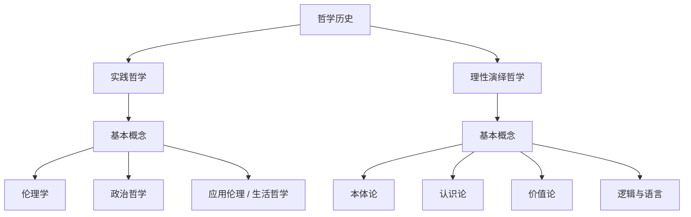

# 哲学
参考：[哲学历史](哲学历史)

## 实践哲学
> 它关注人类行为、伦理、内心安顿、社会秩序，经常与宗教传统融合甚至起源于宗教。

## 理性演绎哲学
链接：[理性演绎哲学](理性演绎哲学/五个基本概念)
> **理性演绎哲学**是一种以理性思考和逻辑推理为基础的哲学方法。它认为，真理可以通过纯粹的理性思辨和演绎推理来获得，而不需要依赖于经验或感官知觉。这种哲学方法强调了逻辑的严谨性和推理的必然性，认为只要从正确的公理或前提出发，就可以推导出可靠的结论。

路线图

